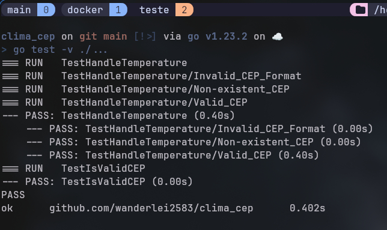

# Sistema de Temperatura por CEP

Este projeto é uma API em Go que recebe um CEP brasileiro, identifica a cidade e retorna a temperatura atual em diferentes escalas (Celsius, Fahrenheit e Kelvin).

## 🌡️ Endpoint Público
```
https://clima-cep-r2xdq7h7yq-uc.a.run.app/temperatura/{cep}
```

Exemplo:
```bash
curl https://clima-cep-r2xdq7h7yq-uc.a.run.app/temperatura/01001000
```

## 📋 Requisitos

- Go 1.23 ou superior
- Docker e Docker Compose
- Conta no Google Cloud Platform
- Chave da API WeatherAPI (https://www.weatherapi.com)

## 🚀 Configuração e Instalação Local

1. Clone o repositório:
```bash
git clone https://github.com/wanderlei2583/clima_cep.git
cd clima_cep
```

2. Instale as dependências:
```bash
go mod tidy
```

3. Configure as variáveis de ambiente:
```bash
cp .env.example .env
```

4. Edite o arquivo `.env` e adicione sua chave da WeatherAPI:
```env
WEATHER_API_KEY=sua_chave_aqui
```

5. Execute os testes:
```bash
go test -v ./...
```


6. Execute localmente:
```bash
go run main.go
```

## 🐳 Executando com Docker

1. Build da imagem:
```bash
docker build -t clima-cep .
```

2. Execute o container:
```bash
docker run -p 8080:8080 --env-file .env clima-cep
```

Ou usando Docker Compose:
```bash
docker-compose up --build
```

## 🌐 Deploy no Google Cloud Run

1. Configure o Google Cloud SDK:
```bash
# Instale o gcloud CLI
curl https://sdk.cloud.google.com | bash
exec -l $SHELL
gcloud init
```

2. Configure o projeto no Google Cloud:
```bash
# Crie um novo projeto (se necessário)
gcloud projects create PROJECT_ID

# Configure o projeto
gcloud config set project PROJECT_ID
```

3. Faça o build e deploy:
```bash
# Build da imagem
gcloud builds submit --tag gcr.io/[PROJECT_ID]/clima-cep

# Deploy no Cloud Run
gcloud run deploy clima-cep \
  --image gcr.io/[PROJECT_ID]/clima-cep \
  --platform managed \
  --region us-central1 \
  --allow-unauthenticated \
  --set-env-vars WEATHER_API_KEY=sua_chave_aqui
```

## 📝 Especificações da API

### Endpoint: `/temperatura/{cep}`

- Método: `GET`
- Parâmetros:
  - `cep`: CEP válido com 8 dígitos

### Respostas

#### Sucesso (200 OK)
```json
{
  "temp_C": 28.5,
  "temp_F": 83.3,
  "temp_K": 301.5
}
```

#### Erro - CEP Inválido (422 Unprocessable Entity)
```json
{
  "message": "CEP invalido"
}
```

#### Erro - CEP Não Encontrado (404 Not Found)
```json
{
  "message": "erro ao obter localidade"
}
```

## 🧪 Executando Testes

```bash
# Execute todos os testes
go test -v ./...

# Execute testes com cobertura
go test -cover ./...
```

## 📁 Estrutura do Projeto

```
.
├── main.go           # Código principal da aplicação
├── main_test.go      # Testes automatizados
├── Dockerfile        # Configuração do Docker
├── docker-compose.yml
├── .env.example      # Exemplo de variáveis de ambiente
├── cloudbuild.yaml   # Arquivo de configuração do Cloud Build
├── deploy.sh         # Script para deploy no Cloud Run
├── LICENSE         # Licença
└── README.md
```

## 🛠️ Tecnologias Utilizadas

- [Go](https://golang.org/)
- [Docker](https://www.docker.com/)
- [Google Cloud Run](https://cloud.google.com/run)
- [ViaCEP API](https://viacep.com.br/)
- [WeatherAPI](https://www.weatherapi.com/)

## 📄 Licença

Este projeto está sob a licença MIT. Veja o arquivo [LICENSE](LICENSE) para mais detalhes.

## ✨ Funcionalidades

- Validação de CEP
- Consulta de localização via ViaCEP
- Consulta de temperatura via WeatherAPI
- Conversão automática entre escalas de temperatura
- Deploy automatizado no Google Cloud Run
- Containerização com Docker
- Testes automatizados

## 🔍 Monitoramento

Para monitorar a aplicação no Google Cloud:

1. Acesse o Console do Google Cloud
2. Navegue até Cloud Run > clima-cep
3. Visualize métricas em:
   - Logs
   - Metrics
   - Error Reporting

## 🐛 Conhecido Problemas e Limitações

- A API WeatherAPI tem limite de requisições no plano gratuito
- O serviço ViaCEP pode apresentar instabilidades
- O Google Cloud Run tem limites no plano gratuito

